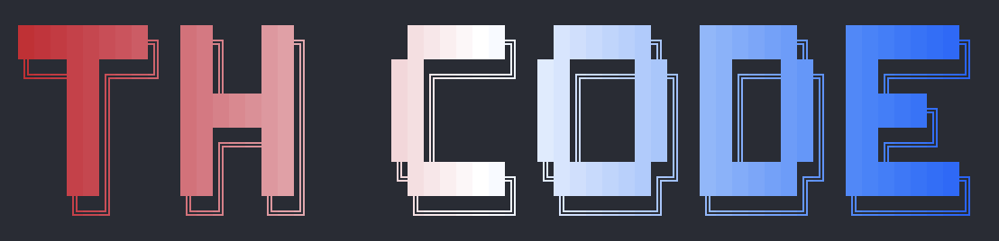

  

Exploring how Thai LLMs perform as the backbone for agentic AI coding tools.

## About

thcode is an experiment in using Thai-language large language models with agentic coding harnesses like [Claude Code](https://docs.anthropic.com/en/docs/claude-code), [OpenAI Codex](https://openai.com/codex), and [opencode](https://opencode.ai).

The goal is to see how far Thai LLMs can go when tasked with real, multi-step software engineering work — not just chat, but actual code generation, editing, and reasoning in an agentic loop.

## Available models

| Model          | Parameters |
| -------------- | ---------- |
| Typhoon-2.5    | 30B        |
| OpenThaiGPT-R1 | 32B        |
| Pathumma-LLM   | 7B         |
| ThaLLE-0.1     | 7B         |

## Roadmap

- [ ] Set up harness configurations for each model
- [ ] Document findings and observations
- [ ] Share results

## Contributing

Contributions are welcome. Open an issue to discuss.

## License

TBD
