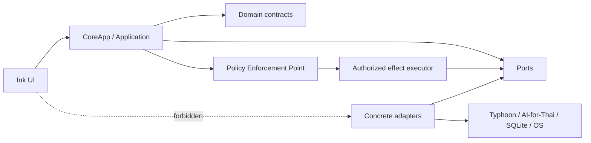
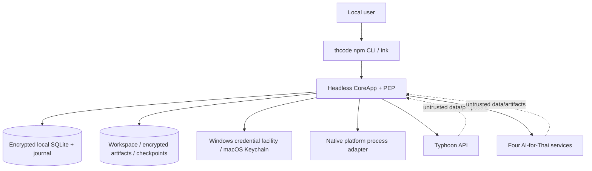

# Architecture Spine — thcode CLI Release 1

`[ADOPTED]` means settled by an authoritative PRD, ADR, or current product boundary; it does not claim the implementation is complete.

## Design Paradigm

**Hexagonal Architecture (Ports-and-Adapters) with one local Policy Enforcement Point (PEP).**

The headless `CoreApp`/Ink split is adopted current reality. The fuller domain/application/ports/adapters taxonomy is the convergence target and does not require a wholesale directory rewrite before feature work.

- `domain/` owns canonical values, state machines, events, and failure contracts.
- `application/` owns use-case orchestration, session mutation, cancellation, and the PEP.
- `ports/` defines inward-facing contracts.
- `adapters/` implements remote, persistence, credential, filesystem, and process ports.
- `ui/` translates terminal interaction into application intents and renders application projections/events.



## Invariants & Rules

### AD-1 — One inward dependency direction

- **Binds:** all Release 1 CLI units
- **Prevents:** UI, vendor, persistence, and OS concerns becoming competing architectural centers.
- **Rule:** Domain and application code depend on domain contracts and ports only. Concrete adapters depend inward. Ink values, vendor objects, database rows, and OS handles never cross their adapter boundary.

### AD-2 — [ADOPTED] CoreApp is the sole UI-facing facade

- **Binds:** Ink TUI, headless core, application protocol
- **Prevents:** TUI components owning runtime state, building domain projections, or bypassing policy.
- **Rule:** UI uses only `CoreProtocolV1`: `dispatch(intent)`, `subscribe({ sessionId, afterSequence })`, and `query(query)`. The shared contract owns exhaustive discriminated unions for prompt/session/authority/health/capability intents; Session/Status/Context/Artifact/Capability projections; durable lifecycle/evidence events; and transient `TokenDelta`/`Progress` events. Shared schema fixtures are compatibility tests, unknown variants are rejected, and major-version mismatch fails startup. UI never imports adapters or builds domain projections.

### AD-3 — One canonical prompt-round and event protocol

- **Binds:** CoreApp, agent loop, UI, persistence, telemetry
- **Prevents:** callback-only authority, incompatible streams, uncorrelated evidence, duplicate replay, and ambiguous cancellation.
- **Rule:** Every operation carries `SessionId`, `PromptRoundId`, `OperationId`, immutable `EventId`, schema version, UTC timestamp, and deterministic/model provenance. `SessionRepository` atomically allocates one monotonic session sequence and aggregate version, appends idempotently, then publishes post-commit. Subscription replay is ordered and at-least-once; consumers deduplicate by `EventId`. Approval, consent, cancellation, and retest are correlated intents/events, never callbacks. Sanitized provider chunks carry upstream sequence/high-water identity and are idempotently appended as durable `RemoteOutputObserved` events before UI publication; completion seals the stream, while interruption restores durable chunks and appends `ChatInterrupted` at the reliable high-water mark. Only non-authoritative progress may be transient; no authority, evidence, content, health, artifact, state, or terminal fact may depend on it. Every accepted operation has one durable terminal outcome.

### AD-4 — [ADOPTED] Remote output is proposal; the PEP is sole effect authority

- **Binds:** providers, specialist services, tools, permissions, effect adapters
- **Prevents:** remote output or application code directly causing local effects after advisory-only checks.
- **Rule:** Remote adapters normalize data and propose actions only. Local schema validation, Work Mode, Permission Profile, consent, workspace, network, command, quota, credential, and hard-boundary checks must pass. One PEP-owned `QuotaLedger` atomically reserves configured allowance under `OperationId` and the applicable user-budget, dependency generation, service, credential-group, transfer, or upstream-quota scope before dispatch; success commits actual use, known non-consumption releases it, and unknown outcome holds an indeterminate reservation until reconciliation. Only a PEP-owned effect executor receives concrete effect adapters. Every effect requires an unforgeable authorization bound to `OperationId`, action digest, authority revision, policy decision, and expiry; adapters reject absent or mismatched authorization. Remote calls require HTTPS with standard certificate/hostname verification; TLS bypass or downgrade is forbidden; unauthorized or cross-origin redirects are rejected; the final origin is revalidated against the current configuration and transfer-consent grant before material is sent. Plan mode rejects mutation structurally under every profile.

### AD-5 — Stable ports define independently-built adapters

- **Binds:** provider, specialist, capability, credential, session, checkpoint, artifact, health, context, and platform epics
- **Prevents:** each epic inventing incompatible lifecycle, data, and failure contracts.
- **Rule:** Define ports for `ReasoningProvider`, `SpecialistService`, `CapabilityRegistry`, `CredentialStore`, `SessionRepository`, `CheckpointRepository`, `ArtifactStore`, `HealthRegistry`, `QuotaLedger`, `ContextBuilder`, `Sanitizer`, `ArtifactResolver`, and `PlatformBoundary`. Ports exchange canonical domain values; vendor objects, database rows, UI values, and OS handles stay inside adapters.

### AD-6 — Session is the persisted aggregate root; Runtime Activation owns live authority

- **Binds:** persistence, restoration, transcript, authority, evidence, context, checkpoints
- **Prevents:** in-memory runtime and SQLite becoming dual authorities or restored sessions reviving temporary authority.
- **Rule:** A Session owns transcript, prompt rounds, Typhoon selection, Work Mode, pins, context decisions, artifacts/evidence, tool and verification history, token ledger, interruption markers, durable Boundary Expansions, workspace association, and checkpoint lineage. Runtime Activation owns the live Permission Profile, temporary approvals, and transfer consent. Application commands serialize mutation per `SessionId`. Opening a missing workspace blocks affected actions; sessions never silently rebind.

### AD-7 — [ADOPTED] Transcript and transmitted model context are separate and attributable

- **Binds:** session persistence, context construction, provider dispatch, usage UI
- **Prevents:** lossy history, uncontrolled prompt growth, and context/provid­er adapters measuring different requests.
- **Rule:** The full transcript is immutable local history. Active Model Context is a bounded derived projection with recorded inclusion, exclusion, and compaction decisions. Only application-owned versioned instructions and Capability Registry tool schemas occupy trusted instruction channels. User, workspace, artifact, tool-result, and remote content is source-labelled, delimited, provenance-bound instruction-inert data; it cannot define tools, change policy, grant authority, or supply executable registry metadata. The provider adapter finalizes canonical serialization, measures against verified effective context capacity, and returns an immutable `ContextManifest` plus transmitted-byte digest before dispatch. Automatic compaction targets no more than 70%; protected content overflow stops before dispatch with categorized accounting and remedies.

### AD-8 — One versioned remote-dependency health lifecycle

- **Binds:** Typhoon and AI-for-Thai configuration, routing, cache, retry, UI status
- **Prevents:** credential presence being mistaken for health, stale checks validating changed configuration, and capability/health disagreement.
- **Rule:** Lifecycle is `unconfigured → configured → checking → available | unavailable | unhealthy | quarantined`; only explicit retest exits quarantine. One immutable `EffectiveConfigurationGeneration` combines public configuration, opaque credential revision, endpoint, mapping/contract, adapter, service/model release, and dependency identity without storing secrets. `HealthRegistry` serializes revisioned transitions, rejects stale outcomes, owns threshold policy, and propagates request/configuration/service/credential-group scope atomically. User-visible capability state composes registry eligibility with current-generation health.

### AD-9 — One safe remote-failure envelope

- **Binds:** adapters, retry policy, quarantine, UI, telemetry
- **Prevents:** vendor-specific branching, contradictory model explanations, and secret leakage.
- **Rule:** Remote failures contain deterministic category, retryability, scope, dependency/configuration generation, operation id, safe message, cause code, evidence reference, and optional retry-after. Raw vendor payloads and secrets are excluded. Model-generated explanations cannot replace or contradict the deterministic category.

### AD-10 — Specialist results are immutable artifacts with cache provenance

- **Binds:** AI-for-Thai routing, consent, caching, evidence, artifact UI
- **Prevents:** service-specific shapes, hidden transfer, untraceable output, and invisible cache reuse.
- **Rule:** Every specialist result records source-content hash, service/configuration generation, returned fields, confidence/uncertainty, empty fields, consent reference, timing, and normalized failure. `ArtifactStore` owns bytes and metadata; events reference immutable artifact ids. Cache identity is the digest of a canonically encoded, versioned `CacheManifest`: capability/contract version, ordered semantic input/artifact ids and content hashes, effective configuration generation, transformation/redaction policy, and operation options. Persist the manifest with the result. Cache lookup precedes live-health gating and may return prior attributable evidence; force-fresh requires current availability and never deletes prior evidence. CoreApp provides safe metadata/preview/redaction projections.

### AD-11 — [ADOPTED] Credentials stay local, isolated, and identity-bound

- **Binds:** provider/service configuration, sessions, events, logs
- **Prevents:** credential reuse across dependencies or leakage through product persistence.
- **Rule:** `CredentialStore` supplies secret material only to the exact verified provider/service identity and host at call time. Typhoon and AI-for-Thai credentials are distinct; one AI-for-Thai key forms one canonical `CredentialGroupId` for its four services. Product persistence stores opaque references/revisions and secret-free fingerprints only. Keys never enter prompts, repositories, logs, telemetry, crash reports, sessions, previews, or UI output.

### AD-12 — Platform effects use stable identity and a fail-closed enforcement matrix

- **Binds:** filesystem, command, network, macOS, Windows
- **Prevents:** path substitution, shell/environment drift, orphan processes, and platform adapters offering unequal safety.
- **Prerequisite:** The approved versioned platform/action matrix (PRD §12.1 PR-3) must exist before Epic 3 begins. Epic 3 implements against the approved matrix; Epic 7 certifies the already-defined matrix and does not define it for the first time.
- **Rule:** A versioned Release 1 platform/action matrix specifies the required mechanism and fail-closed result for every effect on Windows and macOS. Filesystem authorization binds workspace/platform identity, canonical resource identity, and expected digest/version; `PlatformBoundary` revalidates and conditionally applies built-in file changes under a cross-process lock or equivalent compare-and-apply primitive. Mismatch produces conflict without mutation. Recursive directory deletion additionally binds an ordered descendant identity/content manifest, revalidates it, and atomically renames/quarantines the root within the same filesystem before removal; if the platform cannot enforce that transition, deny recursion or require a narrower operation. Descendant change or open-handle uncertainty produces conflict/unknown outcome, never continued best-effort traversal. Revalidation covers symlinks, junctions, mounts, rename, case, and Unicode, using stable handles where available; atomic replacement must preserve the authorized resource-identity policy. Commands resolve approved executable identity, validate argument vector/cwd/environment, use a minimal allowlisted environment without user startup hooks, isolate the process tree, and enforce timeout/cancellation. Unsupported enforcement denies the effect.

### AD-13 — Effects use one operation and uncertainty state machine

- **Binds:** local mutations, remote requests, approvals, checkpoints, retry, recovery
- **Prevents:** retries or crashes duplicating effects and incomplete operations being presented as complete.
- **Rule:** Canonical states are `proposed → authorized → prepared → dispatch-committed → succeeded | failed | cancelled | unknown-outcome → reconciled`. Before dispatch commit, cancellation/revocation denies the effect without consuming single-use authority. The PEP atomically consumes authorization and appends `EffectDispatchCommitted` before invoking the native adapter; that is the check-to-effect linearization point. After it, authority changes affect future effects and cancellation is terminal only when the adapter proves no effect occurred or completed; otherwise `unknown-outcome` outranks optimistic cancellation. Every mutation carries `OperationId`, action digest, precondition, authority/checkpoint references, and durable result. Unknown remote or shell outcomes require deliberate reconciliation and are never automatically retried without proven replay safety.

### AD-14 — [ADOPTED] No silent dependency fallback or protocol repair

- **Binds:** provider and specialist routing
- **Prevents:** invisible substitution or policy relaxation.
- **Prerequisite:** This rule is the single authoritative resolution of PRD FR-6's invalid-structured-proposal behavior (PRD §12.1 PR-1). No later epic or story may re-decide it.
- **Rule:** Unavailable/quarantined dependencies produce typed recovery actions. A different dependency requires an explicit recorded routing decision; Release 1 has no alternate reasoning provider. An invalid structured proposal is rejected after one local validation pass; the validation error is recorded and surfaced as the terminal outcome. Release 1 makes no model repair request, provider retry, protocol reinterpretation, action substitution, or policy relaxation for an invalid proposal.

### AD-15 — [ADOPTED] Capability Registry governs the Release 1 floor

- **Binds:** catalog, router, local tools, health, adapters, UI
- **Prevents:** discovery, routing, and adapters disagreeing about what may execute.
- **Rule:** One reviewed versioned manifest declares stable id, contract version, modalities/input limits, credential group, entitlement/evidence/support level, observation date, trusted metadata, and invokable flag. Release 1 includes workspace list/read/search; bounded create/edit/delete; controlled command execution; dependency preflight; Typhoon; and working `T-OCR`, `Speech-to-Text`, `Extract Address`, and `Named Entity Recognition`. Other catalog entries are visible as `Catalogued — Not available yet` and cannot execute. Model-supplied capabilities, installers, URLs, or commands are never registry authority.

### AD-16 — [ADOPTED] Specialist cache freshness is user-visible and controllable

- **Binds:** specialist routing, evidence, UI
- **Prevents:** incompatible reuse semantics or hidden re-transfer/re-charge.
- **Rule:** Reuse emits visible provenance and retains original evidence. The user can force a fresh run without deleting prior evidence. A quarantined service may still return valid cached evidence; force-fresh is blocked with a typed recovery action until explicit retest succeeds.

### AD-17 — [ADOPTED] Authority dimensions and grants remain independent

- **Binds:** PEP, session, runtime activation, approvals, consent, restoration
- **Prevents:** Full Access, sensitive transfer, operation approval, and durable boundary authority being conflated or reused broadly.
- **Rule:** Evaluate Work Mode, Permission Profile, operation approval, transfer consent, and Boundary Expansion independently. Boundary grants bind stable resource identity, platform/workspace identity, allowed actions, expiry, and revocation. Operation approval binds the exact action digest and `OperationId`; retries or rewritten proposals require new approval unless the same idempotent operation resumes. `PreparedPayloadManifest` has a canonical digest and exact payload-byte digest; transfer consent binds both with verified recipient capability/version/endpoint, purpose, allowed call count, expiry, and operation/prompt scope. Immediately before transport, the PEP recomputes and verifies both digests; any transformation or mismatch requires new consent.

### AD-18 — [ADOPTED] Health failure propagation follows explicit scope and precedence

- **Binds:** provider and specialist health, shared credentials, quarantine
- **Prevents:** request-local failures quarantining configurations or stale success reopening rejected credentials.
- **Rule:** Unsupported input, timeout, network loss, rate limit, quota exhaustion, and upstream server failure remain request/quota states after one occurrence and cannot immediately quarantine. A versioned threshold policy owned by `HealthRegistry` may affect availability or `unhealthy`, but quarantine requires deterministic authentication, protocol, or configuration evidence. Such failures affect the smallest proven scope. Rejected shared AI-for-Thai credentials atomically update every dependent service and outrank in-flight stale successes. Retest is visible, explicit, generation-bound, and timestamped.

### AD-19 — [ADOPTED] Rollback coverage and retention are limited and honest

- **Binds:** checkpoints, built-in file mutations, recovery UI
- **Prevents:** claiming reversibility for shell/remote effects or building incompatible retention behavior.
- **Rule:** Automatic rollback covers checkpointed built-in create/edit/delete only. Compare current content with the recorded post-image; conflicts stop affected reversal and report partial rollback. Default retention is five subsequent prompts and user-configurable. Each checkpoint is capped at 100 MB and the store at 500 MB; binary originals are encrypted. Over-cap actions require explicit confirmation without rollback protection. Expiry removes originals and metadata. Shell, process, remote, permission, symlink-side, and external effects are never claimed reversible.

### AD-20 — [ADOPTED] Persisted evidence has one commit and visibility protocol

- **Binds:** sessions, events, artifacts, health, interruption, evidence, checkpoints
- **Prevents:** orphaned artifacts and half-recorded operations being treated as complete.
- **Rule:** One local operation journal is the authority for commit visibility. Artifacts/checkpoint originals are staged and made durable before a transaction publishes their references and terminal event. Records share `OperationId`, aggregate version, and commit state. One `StoreFormatVersion` gates SQLite, journals, projections, artifact envelopes, and checkpoint envelopes. Migration records intent/progress/checksum, is restartable or reversible, validates before promotion, and on incompatibility or failure opens read-only recovery without running effects or overwriting data. Startup recovery detects incomplete stages, marks unknown outcomes, repairs/cleans unreachable staged data, and never replays side effects. UI completion is visible only from the post-commit event stream.

### AD-21 — [ADOPTED] Sensitive persistence is encrypted with explicit key lifecycle

- **Binds:** SQLite, artifacts/checkpoint originals, workspace lookup, recovery
- **Prevents:** plaintext leakage, database-only compromise, and silent replacement of a lost key.
- **Rule:** AES-256-GCM encrypts sensitive fields and retained originals with a versioned per-install DEK stored in the OS credential facility outside SQLite. Nonces are collision-resistant and never repeat for one key. Each ciphertext envelope records algorithm, key id/version, nonce, authentication metadata, and format version; AAD binds store id, record/entity id, field/content class, schema/format version, and key version, and decryption rejects mismatch before data enters the application. Only minimum metadata and a keyed workspace equality index remain plaintext. Rotation stages a new key, journal-migrates and verifies every durable store, atomically promotes it only after completion, and retains old key material until cleanup is safe. Missing/unreadable keys or interrupted rotation enter locked recovery; existing ciphertext is never overwritten with a newly generated key, and unrecoverability is disclosed.

### AD-22 — [ADOPTED] Runtime Activation is fresh, session/workspace-bound authority

- **Binds:** session creation/open/switch, workspace rebind, permission profile, approvals, consent
- **Prevents:** Full Access or temporary grants leaking across process, session, or workspace boundaries.
- **Rule:** Create a new Runtime Activation on process start, session create/open/switch, and workspace rebind. It starts at Manual with no temporary approval or transfer consent. Work Mode and valid durable Boundary Expansions may restore only after resource revalidation. Every authority mutation increments the activation revision; the PEP atomically revalidates revision and cancellation immediately before effect start.

### AD-23 — [ADOPTED] Release 1 is a local direct-call product on two native platforms

- **Binds:** deployment topology, distribution, platform and remote adapters
- **Prevents:** older prototype scope or detached hosted scaffolds silently redefining the release.
- **Rule:** The authoritative PRD supersedes the Windows-only competition prototype for public Release 1. Support Windows 11 25H2+ with Windows Terminal/PowerShell and macOS 14+ with Terminal/zsh; Linux, WSL, Windows PowerShell 5.1, Git Bash/MSYS, and non-native shells are out of scope. Runtime is Node.js 22+ with clean-machine validation on Node.js 24 LTS and the newest stable supported OS versions. npm is the distribution path. Local adapters call Typhoon and AI-for-Thai directly; hosted `client/`, `server/`, proxy, or Compatibility Layer components are outside the Release 1 request path.

### AD-24 — [ADOPTED] Sanitization is a mandatory shared boundary

- **Binds:** persistence, UI, logs/telemetry, export, model context, previews, evidence
- **Prevents:** each epic applying incompatible redaction or leaking secrets through a secondary output path.
- **Rule:** One versioned `Sanitizer` runs before potentially sensitive content is persisted, displayed, logged, exported, included in model context, or summarized for action/transfer. Policies are content-class-specific and cover credentials/tokens, headers, URLs/query values, environment values, errors/stacks, command/tool output, remote payloads, paths, and classified user content. Sanitized values carry policy version and source-evidence reference. Raw prompt, command, and payload export is disabled by default.

### AD-25 — [ADOPTED] ArtifactResolver owns transfer preparation

- **Binds:** workspace, context, specialist routing, consent, artifacts
- **Prevents:** remote adapters receiving local paths as authority or independently choosing what bytes leave the machine.
- **Rule:** `ArtifactResolver` resolves explicit in-workspace code, Markdown, text, image, audio, PDF, DOCX, and bounded-directory references; validates stable containment, type, format, size, privacy policy, and service compatibility; and emits an immutable prepared-content manifest. PDF/DOCX text is extracted locally by default. Originals transfer only when required and exactly consented. Unsupported binaries send sanctioned metadata only or fail. Remote requests receive prepared bytes/text and manifest, never unresolved local paths or fetch authority.

### AD-26 — Session deletion and artifact retention share one lifecycle

- **Binds:** SessionRepository, ArtifactStore, specialist cache, privacy retention
- **Prevents:** session deletion silently retaining exclusive sensitive evidence or deleting bytes shared by another session.
- **Rule:** Local Session deletion is one journaled tombstone operation that immediately makes the Session aggregate, transcript/events, context manifests, token ledger, checkpoints, projections, and evidence inaccessible; removes artifact/cache references; decrements content-addressed reference counts; purges zero-reference sensitive artifacts/manifests; and invalidates their cache entries. Bytes referenced by another live session or explicit retention record remain. WAL/journal staging and encrypted remnants are checkpointed/cleaned under the secure-retention policy; only a non-sensitive deletion audit tombstone persists. Partial cleanup is recoverable without reviving the session. Time-based retention may be configured, but no unreferenced sensitive content is retained without an explicit retention record.

### AD-26.1 — Provider-side deletion is conditional and policy-bound

- **Binds:** Specialist Services, sensitive-data policy (PRD §12.1 PR-2), provider contracts, quarantine
- **Prevents:** implying an upstream deletion API or universal no-retention guarantee that the provider contract does not support.
- **Rule:** Provider-side deletion lifecycle states (`upstream-no-retention-verified`, `deletion-not-required`, `deletion-pending`, `deletion-confirmed`, `deletion-failed`) are **conditional on the verified provider contract supporting them for the exact recipient, endpoint, capability/version, configuration generation, and data class**. No-retention is preferred but not universally required. If the provider contract does not support a deletion lifecycle, transfer to that configuration is `BLOCKED` rather than assumed safe, and no provider-deletion lifecycle state is published. Provider-deletion handling is verified before any payload is prepared for transport under the approved sensitive-data policy (PRD §12.1 PR-2); it is not first created by a later release-certification story. A failed provider deletion that the contract permits retrying quarantines the affected Specialist Service and configuration until explicit retest succeeds.

### AD-27 — [ADOPTED] One PermissionMatrix defines action eligibility

- **Binds:** PEP, every tool, specialist transfer, Work Mode, Permission Profile
- **Prevents:** independently-built effects interpreting Manual, Assisted, and Full Access differently.
- **Rule:** A versioned `PermissionMatrix` maps action class × Work Mode × Permission Profile × risk/sensitivity × hard-boundary state to `allow | ask | deny`. Manual permits bounded non-sensitive reads and asks for eligible mutations/sensitive actions. Assisted applies deterministic rules and asks on uncertainty. Full Access suppresses only eligible prompts inside declared boundaries. Plan denies mutation. Sensitive transfer always requires AD-17 consent. Hard boundaries always deny. Unknown action classes fail closed.

### AD-28 — Operation status, lifecycle, Evidence completeness, measurement, and exit are distinct dimensions

- **Binds:** CoreProtocolV1, UX state registry, evidence records, headless/redirected/JSON output, exit codes
- **Prevents:** conflating operation outcome with lifecycle facts, Evidence completeness, measurement quality, and process exit, which can produce false success, unnecessary blocking, or ambiguous headless output.
- **Companion:** The authoritative UX state registry is bound to CoreProtocolV1 through this rule; the UX DESIGN.md and EXPERIENCE.md documents are listed as architecture companions (see frontmatter) and their canonical interaction/state contracts are not optional UI details.
- **Rule:** `ux-state-v1` (and the corresponding CoreProtocolV1 fields) MUST keep the following dimensions mechanically distinct:

  1. **Operation status** — terminal outcome of an operation: `succeeded | failed | blocked | malformed | denied | refused | cancelled | unknown-outcome | reconciled`.
  2. **Lifecycle fact** — nonterminal observation about a state transition, not itself a terminal outcome: `proposed`, `authorized`, `prepared`, `dispatch-committed`, `effect-already-committed`, `cancel-requested`, `cancel-acknowledged`, `still-running`, `interruption-cancelled`, `interruption-unknown`. `effect-already-committed` means dispatch commit was observed before cancellation/revocation; the underlying effect may still succeed, fail, or remain unknown, and it MUST NOT independently map to operation-status `succeeded` or exit `SUCCESS=0`.
  3. **Evidence completeness** — qualifier of an Evidence record, not a terminal operation state: `complete`, `partial`, `sanitized-with-omissions`, `stale`, `unavailable`, `corrupt`, `not-authoritative`.
  4. **Measurement quality** — qualifier of a measured value, not a terminal operation state: `estimated`, `provider-reported`, `locally-measured`, `fallback`, `unknown`, `percentage unavailable`.
  5. **Process exit** — one symbolic exit class (`NONE` for nonterminal rows; otherwise `SUCCESS | BLOCKED | FAILED | UNKNOWN`) plus one numeric exit code per surface contract.

  An operation row in the registry has exactly one operation status, zero or more lifecycle facts that are NOT terminal, zero or more Evidence-completeness qualifiers on its Evidence records, zero or more measurement-quality qualifiers on its measured values, and exactly one process-exit class. `COMMAND_ERROR` is a fixed error display heading layered over a canonical operation status of `blocked` or `malformed`; it is not a distinct operation status and is not a 74th registry row. The registry's exit-class/exit-code, terminality, JSON token, narrow form, cause, retryability, recovery, and Thai-capable localized explanation fields are versioned and validated as part of CoreProtocolV1. The implementation-safe default caps that bound deterministic behavior (artifact size, recursion depth, search work, process count, prompt-round wall time, transfer bytes) are defined separately from NFR-14 performance SLOs and live in the versioned registry or its referenced policy, not in a later performance-budget gate.

## Consistency Conventions

| Concern | Convention |
| --- | --- |
| Entity and port names | PascalCase singular nouns; ports describe capability, not vendor. |
| Identifiers | Opaque typed `<Entity>Id`; generated once by the owning boundary. |
| Events | Past-tense types in the AD-3 envelope; append post-commit in session sequence. |
| Time | UTC ISO 8601 at boundaries; injected clock for tests. |
| Text | UTF-8 end to end; preserve Thai and technical identifiers. |
| Failures | AD-9 typed envelope; no vendor exceptions beyond adapters. |
| State mutation | Serialized application command per Session; optimistic aggregate version on append. |
| Configuration | Validated public config + opaque credential revision produce AD-8 generation. |
| Logging | Structured local records with correlation ids and provenance; secret-safe fields only. |
| Tool registration | Explicit mutating classification and versioned schema; unknown classification rejected. |
| Serialization | Version persisted/events independently; migrations stay with owning adapter. |
| Status | Never rely on color alone; narrow-terminal text representation is required. |

## Stack

| Name | Version |
| --- | --- |
| Node.js runtime | `>=22` |
| Release validation runtime | `24 LTS` |
| TypeScript | `5.9.3` |
| Ink | `5.2.1` |
| React | `18.3.1` |
| better-sqlite3 | `11.10.0` |
| Vitest | `2.1.9` |

Dependency versions are lockfile-observed seed, not proof of release compatibility. Node 24/native-module compatibility and clean-machine installation are release gates.

## Structural Seed

```text
cli/src/
  domain/          # canonical values, events, states, failures, authority grants
  application/     # CoreApp, use cases, projections, PEP, effect executor
  ports/           # inward contracts implemented by adapters
  adapters/
    providers/     # Typhoon
    specialists/   # four launch AI-for-Thai integrations
    persistence/   # SQLite repositories, journal, migrations
    platform/      # Windows/macOS credential, filesystem, process adapters
  ui/              # Ink intents, subscriptions, queries, rendering only
```

Existing `cli/src/core/*` may converge incrementally; feature work must obey the boundaries before directories move.



## Capability → Architecture Map

| Capability / Area | Lives in | Governed by |
| --- | --- | --- |
| TUI intents, replay, projections | `ui/`, `CoreApp` | AD-2, AD-3 |
| Reasoning turns and streaming | application, provider port/adapter | AD-3, AD-4, AD-7, AD-13, AD-14 |
| Local tools and verification | PEP, effect executor, platform adapters | AD-4, AD-12, AD-13, AD-15 |
| Authority and restoration | PEP, PermissionMatrix, Session, Runtime Activation | AD-4, AD-6, AD-17, AD-22, AD-27 |
| Sessions, events, crash recovery | session repository, journal | AD-3, AD-6, AD-20, AD-21 |
| Active Model Context and usage | context builder, sanitizer, provider adapter | AD-7, AD-24 |
| Provider/service onboarding and health | credential/health ports, adapters | AD-8, AD-9, AD-11, AD-14, AD-18 |
| Quota and resource boundaries | PEP, quota ledger, dependency adapters | AD-4, AD-8, AD-13 |
| Capability discovery | registry, application preflight | AD-4, AD-15 |
| AI-for-Thai execution | artifact resolver, specialist adapters, artifact store | AD-8, AD-10, AD-11, AD-15, AD-16, AD-18, AD-24, AD-25 |
| Session deletion and evidence retention | session repository, artifact store, cache index | AD-20, AD-21, AD-26, AD-26.1 |
| Sanitized evidence and output | sanitizer, application projections | AD-3, AD-9, AD-24 |
| Artifact resolution and transfer | artifact resolver, consent, specialist adapters | AD-10, AD-17, AD-25 |
| Rollback | checkpoint repository, built-in file tools | AD-13, AD-19, AD-20, AD-21 |
| Canonical state/exit registry and UX companionship | CoreProtocolV1, ux-state-v1, headless/redirected/JSON output | AD-2, AD-3, AD-28 |
| Cross-platform safety | platform adapters, enforcement matrix | AD-12, AD-17, AD-22, AD-23 |

## Deferred

- Exact TypeScript payload fields beyond the required AD-3 envelope and protocol categories — settle in the versioned CoreApp contract tests.
- Exact SQLite tables, columns, indexes, journal encoding, and migration library — owned by persistence under AD-3, AD-6, AD-20, and AD-21.
- Per-tool schema details and platform mechanism choices — owned by each tool/platform adapter under the required AD-12 enforcement matrix.
- Individual specialist wire mappings — adapter-local under AD-8 through AD-16.
- Exact time-based artifact/cache retention duration and user controls outside the fixed rollback window — lifecycle ownership, reference cleanup, and no-orphan behavior are fixed by AD-26.
- Concrete logging library and telemetry retention — conventions bind behavior without fixing a package.
- Ink component tree and visual styling — UI-local while AD-2/AD-3 projections hold.
- Installer/update-channel mechanics beyond npm and clean-machine acceptance.
- Exact Typhoon model, endpoint, and adapter release pins — Typhoon is fixed; live compatibility must be frozen before release.
- Post-Release-1 role or removal of `client/` and `server/`.
